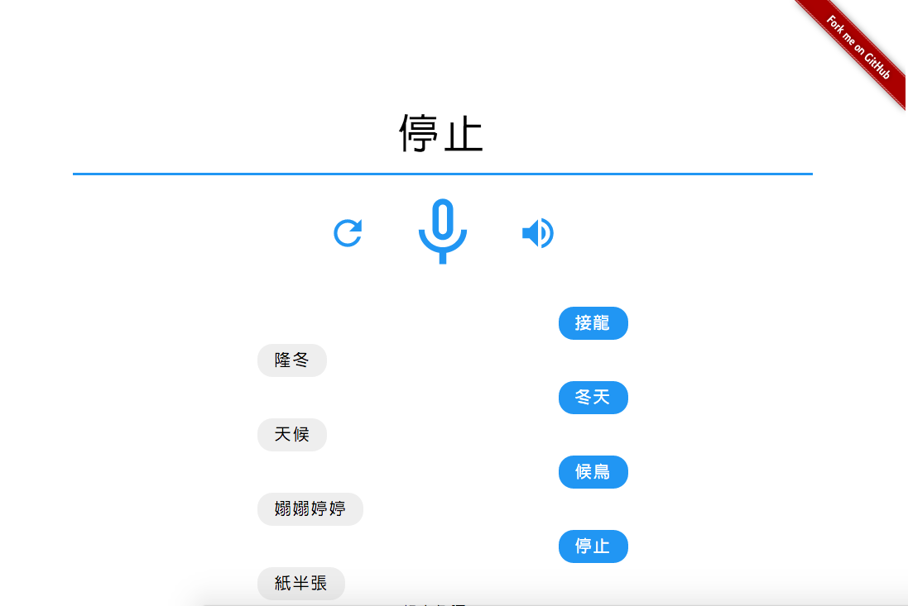

# 語音接龍
B01705041 資管四 郝晉凱

## 目的
文字接龍是小時候常玩的一種遊戲，遊戲方式很簡單，當玩家講出一個詞後，下一個玩家就要從上一個玩家最後講的那個字開始接下一個詞，並一直接下去，直到有一方想不出新的詞就結束了。例如：當玩家A說了`蘋果`，玩家B就要講一個`果`開頭的詞，像是`果然`。而接龍也有很多種不同玩法，這裡就不一一介紹，而現在網路上有的文字接龍遊戲非常少（至少我沒有找到），如果又要能以語音辨識遊玩的話那更是很難找到，於是我便做了一個語音辨識的文字接龍小遊戲。

## 規則
最後寫出來的原型已經可以對著電腦 AI 做基本的語音接龍遊戲，按下畫面上的麥克風後就可以開始接龍的第一個詞，電腦會根據最後一個字的音隨機選出一個新的詞來回應，而為了讓遊戲更加彈性也可以玩更久，接龍只要音對就可以，字不需要完全一樣，另外聲調的部分也可以不考慮，例如 `ㄕㄥˊ` 可以接 `ㄕㄥˋ` ，但電腦還是會優先回應同樣聲調的字。電腦回應詞後也會隨即唸一遍該詞，讓人更有和電腦以語音對玩的感覺。點擊電腦回應的詞後也會外連至 **萌典** 辭典網站找到該詞的解釋。玩家也可以用打字的方式來遊玩。

示範一些實際的接龍規則：
* `測試` ---> `試題` Ｏ
* `測試` ---> `示範` Ｏ
* `測試` ---> `時間` Ｏ
* `測試` ---> `獅子` Ｏ
* `測試` ---> `肆意` Ｘ
* `測試` ---> `斯文` Ｘ

## 實作
1. #### 準備
我選擇寫出 web app 的介面，這樣只要有電腦即可遊玩，也不需要下載任何其他軟體。  
語音辨識的核心我使用 HTML5 的新的 **Web Speech API** 實作，它在辨識的準確度和使用難度上都非常出色，核心是使用 Google 提供的語音辨識技術，但也因為這個 API 非常新，目前也只有新版的 Chrome 可以使用。  
程式語言的方面我選擇 **Node.js** ，因為他與 web app 介面有很好的相容性，讓我可以只用 **JavaScript** 一種語言完成整個 app 。  

2. #### 前處理
接龍遊戲必須要先要辭典的資料庫，這部分我是採用**教育部修訂版**的線上辭典的資料庫，在社群上找到了開源的辭典檔，透過一些轉換和前處理轉成我可以利用的格式，存成一個約 10 MB 的 json 檔，進入網頁時直接讀取該檔案，省下了建立資料庫的麻煩。  

3. #### 過程
實際的程式邏輯很簡單，即是將使用者對麥克風輸入的音訊，透過 API 轉換成文字，將文字送入辭典做比對，找出最後一個字的音，再根據結果去找出辭典中以該音開頭的辭，輸出到介面上給使用者，使用者再繼續接下去。  
其中經過了滿多字串的處理，以及對於錯誤的偵測，要能在適當的時機暫停遊戲。  

4. #### 困難
過程中也遇到了一些較難以處理的困難，像是：
* 辭典的詞過少，有很多常見的詞沒有收錄，也有很多非常少見的詞被收錄進去了，這部分要再針對辭典的詞做擴充。
* 語音辨識過於敏感，玩家在玩接龍時常常會有類似 `ㄜ...` 的一段習慣性的語助詞，而語音辨識很可能會將其辨識進去而造成與實際的詞的偏差，但讓玩家想好後再開始收音又會減少遊戲的流暢性。
* 在中文上有一些相近的音很難判斷或辨識，像是 `出生` 和 `出身` 在做語音辨識時很難辨別，接龍時便會判斷成不同的音 `ㄕㄥ` 與 `ㄕㄣ` ，常常必須針對這個問題想別的新的詞接。程式可以試著判定 `ㄥ` 和 `ㄣ` 這種相近的音都為互相允許的接音，但是語音辨識仍然很難正確判斷玩家到底是講哪一個詞。

## DEMO

遊戲原型已經上線並放在 Github 提供的伺服器上，以桌機版 Chrome 開啟此網頁 [https://kevin940726.github.io/Solitaire/](https://kevin940726.github.io/Solitaire/) (為了更好的體驗，請使用`https`) ，允許麥克風的輸入後就可以開始遊戲，另外程式的原始碼也同時開源，點選遊戲畫面右上角的 **Fork me on Github** 就可以連至專案的目錄。

## TODO
* 加入語音辨識的自訂文法，讓辨識更加準確。
* 加入注音符號方便閱讀。
* 增加辭典的詞庫。
* 調整音量功能。
* UI/UX 優化
